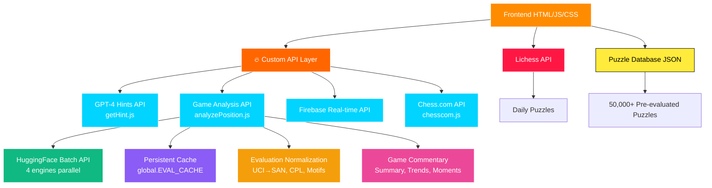

# PawnPush ♟️

PawnPush is a modern, interactive chess puzzle platform designed to help players improve their skills through a vast collection of puzzles. Featuring a sleek dark theme with vibrant orange accents, accessible online at [https://pawn-push.vercel.app](https://pawn-push.vercel.app), it offers categorized puzzles, AI-powered hints, and a coaching chat for personalized guidance.

*Experience the modern dark theme with vibrant orange accents, yellow glow hints, and immersive audio feedback*

## 🔥 **Custom API Integration**

**Built and deployed my own custom API from scratch!** The entire hint system, AI coaching, and Stockfish integration runs through a custom-built serverless API that's live on the website. This includes:
- **Custom GPT-4 hint API** - intelligently analyzes positions and provides contextual coaching
- **Stockfish integration API** - powerful chess engine analysis via HuggingFace API
- **Chess.com API integration** - fetch and analyze games directly from Chess.com
- **Firebase real-time API** - seamless multiplayer synchronization
- **Fully deployed and production-ready** - handling real users on [pawn-push.vercel.app](https://pawn-push.vercel.app)

*No third-party hint services - everything is custom-built and optimized for PawnPush!*

## ✨ Features

### 🎯 **Core Puzzle Experience**
- **Multiple difficulty levels**: Beginner, Intermediate, Advanced, Grand Master
- **Various position types**: Opening, Middlegame, Endgame, Checkmate
- **Daily puzzles** with fresh content from Lichess API
- **Over 50,000 pre-evaluated puzzles** with optimal side selection
- **Interactive chessboard** with smooth drag-and-drop functionality
- **Smart puzzle orientation** - always play from the winning side

### ⚔️ **Multiplayer Features**
- **1v1 Private Battles** - Challenge friends with 6-digit room codes
- **Real-time score tracking** - See your opponent's progress live
- **5-minute puzzle races** - 20 puzzles, most solved wins
- **Firebase-powered rooms** - Seamless real-time synchronization
- **Instant matchmaking** - Create or join rooms in seconds
- **Cross-device support** - Battle from any device, anywhere

### 🤖 **AI-Powered Learning**
- **Advanced Agentic AI Coach** - Multi-step reasoning system with GPT-4.1-mini
- **Stockfish Integration** - Real-time chess engine analysis via HuggingFace API
- **Tactical Pattern Detection** - Automatic detection of forks, pins, skewers, hanging pieces, and overloaded pieces
- **Position Facts System** - Comprehensive board analysis with attack/defense maps
- **Safe AI Responses** - Verification system prevents hallucinated moves and squares
- **Progressive hints** with beautiful yellow glow visual cues
- **Move validation** with instant feedback and audio cues
- **Intelligent move highlighting** - correct moves glow turquoise, wrong moves glow red

### 🎨 **Enhanced User Experience**
- **Modern dark theme** with deep `#121212` background for premium gaming feel
- **Vibrant orange accents** (`#ff8c00`) throughout the interface with grey-orange banners
- **Animated homepage stats** - numbers count up on page load with smooth animations
- **Interactive infinity symbol** - morphs from counting numbers to ∞ symbol
- **Chess.com piece theme** for professional, familiar appearance
- **Yellow glow hints** - beautiful visual cues for puzzle assistance
- **Audio feedback** - centralized audio management system with satisfying sound effects
- **Smooth animations** for puzzle transitions and UI interactions
- **Instant move feedback** for responsive gameplay
- **Mobile-responsive design** that works on all devices
- **Direct puzzle access** - no account required

### 🎮 **Game Modes**
- **Puzzle Mode** - Practice with filtered puzzles, automatic opponent moves
- **Survival Mode** - Test your skills with lives system and progressive difficulty  
- **⚔️ 1v1 Private Battle** - Challenge friends in real-time puzzle races with private room codes
- **🏆 Global Leaderboard** - Compete worldwide with Firebase-powered cross-device rankings
- **Daily Puzzle** - Fresh challenge from Lichess every day with animated rating
- **Game Review** - Production-grade game analysis with unified batch-mode architecture
  - **Unified Architecture**: Frontend sends FEN history → Backend performs 100% of engine work
  - **Batch-Mode Analysis**: HuggingFace Stockfish API with 4-engine parallel processing (depth 18, multipv 3)
  - **Persistent Caching**: Global cache persists across requests, eliminating redundant API calls
  - **Intelligent Evaluation Normalization**: Explicit perspective tracking (side-to-move vs White's POV) prevents double conversion
  - **Advanced Move Detection**: Brilliant moves (sacrifice + tactical + gap≥150), Great moves (gap≥120), Only moves (gap≥150)
  - **Tactical Motifs**: Automatic detection of checks, captures, forks, checkmates
  - **Blunder Swing Detection**: Identifies significant evaluation swings (≥180 centipawns)
  - **Engine Trend Analysis**: Tracks position evaluation changes move-by-move
  - **Full Game Commentary**: Opening, middlegame, endgame summaries with key turning points and narrative
  - **Chess.com Integration**: Import games directly with archive selection and time control filtering
  - **Canvas-Drawn Arrows**: Color-coded best move visualization (green/blue/purple for top 3 lines)
  - **Move Classification**: Best, Good, Inaccuracy, Mistake, Blunder based on CPL thresholds
  - **Performance Metrics**: Accuracy %, ACPL, and estimated rating for both players (Stockfish-like formulas)
  - **Preview Mode**: Visualize engine lines with multi-step arrow sequences
  - **Robust PGN Parsing**: Handles Chess.com clock annotations, comments, and variations
  - **Real-time Updates**: Dynamic eval bar, move list, accuracy/ACPL charts, and comprehensive summary
- **Automatic Opponent Responses** - Computer plays opponent moves seamlessly
- **Color-coded difficulty** - Cyan (Beginner) → Blue (Intermediate) → Yellow (Advanced) → Red (Expert)

## 🆕 Recent Enhancements (2025)

### **Agentic AI Coach System**
- Built **multi-step reasoning AI** using GPT-4.1-mini with tool calling
- Implemented **Stockfish integration** for real-time position analysis
- Created **tactical pattern detection** system (forks, pins, skewers, hanging pieces, overloaded pieces)
- Developed **position facts engine** with comprehensive attack/defense mapping
- Added **safe response verification** to prevent AI hallucinations
- Integrated **pseudo-legal attack maps** for accurate tactical analysis

### **Game Review Overhaul (Production-Grade)**
- **Unified Architecture Refactor**: Frontend removed all engine logic, backend performs 100% of analysis work
- **Batch-Mode System**: Upgraded to HuggingFace batch endpoint with 4-engine parallel processing
- **Persistent Global Cache**: `global.EVAL_CACHE` persists across requests, eliminating redundant API calls
- **Evaluation Normalization Fix**: Explicit perspective tracking prevents double conversion (side-to-move vs White's POV)
- **Advanced Move Classification**: Brilliant (sacrifice + tactical + gap≥150), Great (gap≥120), Only Move (gap≥150) detection
- **Tactical Motif Detection**: Automatic identification of checks, captures, forks, checkmates per move
- **Blunder Swing Detection**: Identifies significant evaluation swings (≥180 centipawns) as turning points
- **Engine Trend Analysis**: Tracks position evaluation changes move-by-move (improving/declining/stable)
- **Full Game Commentary**: Comprehensive summaries with opening/middlegame/endgame analysis, key moments, and narrative
- **UCI→SAN Conversion**: Unified, bug-free function for converting engine move sequences
- **MultiPV Synthesis**: Handles single-move responses by synthesizing multiPV arrays for consistent UI
- **CPL Classification Upgrade**: Updated thresholds (Best≤15, Good≤40, Inaccuracy≤80, Mistake≤200, Blunder>200)
- **Accuracy & Rating Formulas**: Stockfish-like decay formulas for accuracy and rating estimation
- **Canvas-Drawn Arrows**: Color-coded best move visualization with multi-PV support
- **Chess.com API Integration**: Archive selection and time control filtering
- **Robust PGN Parsing**: Handles Chess.com clock annotations, comments, and variations
- **Performance Metrics**: Accuracy %, ACPL, estimated rating for both players with charts

## 🏗️ **System Architecture**



## 🛠️ Technologies Used

- **Frontend:** HTML5, CSS3, Vanilla JavaScript
- **Custom API Layer:** 🔥 Built from scratch - serverless GPT-4.1-mini, dual Stockfish engines, Firebase integration
- **Chessboard UI:** [Chessboard.js](https://chessboardjs.com/) with Chess.com piece theme and canvas arrow overlay
- **Chess Logic:** [chess.js](https://github.com/jhlywa/chess.js) for move validation and position analysis
- **Backend:** Firebase Firestore for real-time multiplayer rooms and global leaderboard
- **AI Integration:** Agentic GPT-4.1-mini with tool calling, multi-step reasoning, and tactical pattern detection
- **Engine Integration:** 
  - HuggingFace Stockfish Batch API (depth 18, multipv 3, 4 engines parallel)
  - Persistent global caching (`global.EVAL_CACHE`) for cross-request persistence
  - Unified evaluation normalization with explicit perspective tracking
  - Batch-mode processing for efficient full-game analysis
- **External APIs:** Lichess API for daily puzzles
- **Piece Graphics:** Chess.com piece theme for professional appearance
- **Styling:** Custom CSS with modern dark theme and vibrant color system
- **Audio:** HTML5 Audio API for immersive sound effects
- **Color Scheme:** Deep dark backgrounds with orange (`#ff8c00`), grey-orange banners, and vibrant mode-specific colors

## 📁 File Structure

```
PawnPush/
│
├── api/                       # 🔥 Custom-built API layer
│   ├── getHint.js            # Agentic AI Coach with GPT-4.1-mini + Stockfish (~1500 lines)
│   │                         # - Multi-step reasoning with tool calling
│   │                         # - Tactical pattern detection (forks, pins, skewers)
│   │                         # - Position facts engine with attack/defense maps
│   │                         # - Safe response verification system
│   ├── analyzePosition.js    # Production-grade game analysis API (~714 lines)
│   │                         # - Unified batch-mode architecture (backend does 100% engine work)
│   │                         # - HuggingFace batch API with 4-engine parallel processing
│   │                         # - Persistent global caching (global.EVAL_CACHE)
│   │                         # - Explicit evaluation normalization (side-to-move vs White's POV)
│   │                         # - Brilliant/Great/Only Move detection
│   │                         # - Tactical motifs (check, capture, fork, checkmate)
│   │                         # - Blunder swing detection (≥180 centipawns)
│   │                         # - Engine trend analysis (improving/declining/stable)
│   │                         # - Full game commentary (opening/middlegame/endgame summaries)
│   │                         # - UCI→SAN conversion, CPL classification, accuracy/rating formulas
│   ├── chesscom.js           # Chess.com API integration for game imports
│   ├── stockfish.js          # Legacy single-position Stockfish API
│   └── firebase.js           # Firebase API configuration
│
│
├── index.html                 # Main landing page
├── puzzle.html                # Regular puzzle interface
├── dailyPuzzle.html           # Daily puzzle page
├── game-review.html           # Game analysis page
├── pvp.html                   # 1v1 Private Battle interface
├── survival.html              # Survival mode page
│
├── IndexScript.js             # Main site logic, animated stats, daily puzzle loading
├── audio-manager.js           # Centralized audio management system
├── PuzzleScript.js            # Regular puzzle logic with audio integration
├── dailyPuzzle.js             # Daily puzzle functionality with audio
├── game-review.js             # Game analysis frontend (~937 lines)
│                             # - Zero engine logic (sends FEN history to backend)
│                             # - Receives fully processed analysis data
│                             # - Canvas arrows, eval bar, move list, charts
│                             # - Accuracy/ACPL visualization, summary display
├── survival.js                # Survival mode with lives system and global leaderboard
├── pvp.js                     # 1v1 multiplayer with Firebase real-time rooms
│
├── style.css                  # Modern dark theme with orange accents
├── audio/                     # Sound effects directory
│   ├── move.mp3              # Move sound effect
│   ├── capture.mp3           # Capture sound effect
│   ├── castle.mp3            # Castling sound effect
│   ├── move-check.mp3        # Check sound effect
│   ├── wrong.mp3             # Wrong move sound effect
│   └── solved.mp3            # Puzzle solved sound effect
├── puzzles.json               # 50,000+ pre-evaluated puzzle database
├── package.json               # NPM dependencies
└── README.md                  # This file
```


## Setup Instructions

### Prerequisites

- Node.js version 12 or higher
- OpenAI API key (sign up at [OpenAI](https://platform.openai.com/))

### Installation

1. Clone the repository:

```bash
git clone <your-repo-url>
cd PawnPush
````

2. Install dependencies:

```bash
npm install
```

3. Configure environment variables:

Create a `.env` file in the root directory:

```env
OPENAI_API_KEY=your-openai-api-key
HF_TOKEN=your-huggingface-token
```

4. Run the development server:

```bash
npm run dev
```

The app will be available locally at `http://localhost:3000`.

## 🚀 Quick Start

### **Play Online**
Visit [https://pawn-push.vercel.app](https://pawn-push.vercel.app) to start solving puzzles immediately - no account required!

### **How to Play**
1. **Choose your mode**: Regular puzzles, Daily puzzle, Survival, or 1v1 Battle
2. **Select difficulty**: Beginner to Grand Master (or battle your friend!)
3. **Pick position type**: Opening, Middlegame, Endgame, or Checkmate
4. **Make moves**: Drag and drop pieces on the interactive board
5. **Get hints**: Use the hint system or AI coaching chat
6. **Solve puzzles**: Complete puzzles to improve your chess skills

### **1v1 Battle Mode**
1. **Host**: Click "Create Room" and share the 6-digit code with your friend
2. **Guest**: Enter the room code to join
3. **Battle**: Race to solve the most puzzles in 5 minutes
4. **Win**: Player with the highest score wins the match!

### **Features to Try**
- 🎯 **Daily Puzzle**: Fresh puzzle every day from Lichess with animated rating display
- ⚔️ **1v1 Battle**: Challenge friends with private room codes in 5-minute puzzle races
- 🤖 **AI Coach**: Ask questions about positions and moves
- 💡 **Smart Hints**: Progressive hints with beautiful yellow glow effects
- 🏆 **Global Leaderboard**: Compete worldwide with cross-device Firebase rankings
- 🔊 **Audio Feedback**: Satisfying sound effects for every move and action
- 🎨 **Modern UI**: Sleek dark theme with vibrant orange accents and animated homepage stats
- 📱 **Mobile Friendly**: Works perfectly on phones and tablets

## 🔧 How It Works

### **Puzzle System**
- **Database**: 50,000+ puzzles with pre-computed evaluations
- **Daily Updates**: Fresh puzzles from Lichess API
- **Smart Filtering**: Puzzles categorized by difficulty and position type
- **Move Validation**: Real-time validation using chess.js
- **Intelligent Orientation**: All puzzles evaluated to ensure users play the winning side
- **Seamless Gameplay**: Computer automatically plays opponent responses

### **Agentic AI Integration**
- **GPT-4.1-mini with Tool Calling**: Multi-step reasoning system for chess coaching
- **Stockfish Integration**: Real-time engine analysis via HuggingFace API
- **Tactical Pattern Detection**: Automatic identification of forks, pins, skewers, hanging pieces, overloaded pieces
- **Position Facts Engine**: Comprehensive board analysis with attack/defense maps and pseudo-legal move generation
- **Safe Response System**: Verification layer prevents AI hallucinations (invalid squares, pieces, or tactics)
- **Contextual Analysis**: AI analyzes current position and provides relevant guidance based on actual board state
- **Progressive Assistance**: Multiple hint levels from visual cues to full solutions with engine-backed explanations

### **Multiplayer System**
- **Firebase Firestore**: Real-time room synchronization and data persistence
- **Private Rooms**: Secure 6-digit room codes for private matches
- **Live Updates**: Instant score synchronization using onSnapshot listeners
- **Room States**: Waiting → Countdown → In Progress → Finished
- **Automatic Cleanup**: Rooms are cleaned up when host leaves
- **Cross-Device**: Battle from desktop vs mobile, any combination works

### **User Experience**
- **Modern Dark Theme**: Deep `#121212` background with premium gaming aesthetic
- **Vibrant Color System**: Orange (`#ff8c00`) for main actions and stats, grey-orange banners for selection sections
- **Animated Homepage**: Numbers count up smoothly on load, infinity symbol morphs from counting numbers
- **Centralized Audio System**: AudioManager class handles all sound effects with mobile optimization
- **Chess.com Pieces**: Professional, familiar piece graphics
- **Audio Integration**: Sound effects for moves, captures, castling, checks, and puzzle completion
- **Visual Feedback**: Color-coded move validation and beautiful orange glow effects
- **Smooth Animations**: Beautiful transitions between puzzles with shine effects on buttons
- **Game Review Features**: 
  - Unified batch-mode architecture (backend performs 100% engine work)
  - HuggingFace batch API with 4-engine parallel processing
  - Persistent global caching eliminates redundant API calls
  - Explicit evaluation normalization prevents double conversion
  - Brilliant/Great/Only Move detection with tactical analysis
  - Tactical motifs (check, capture, fork, checkmate) per move
  - Blunder swing detection identifies turning points
  - Engine trend analysis tracks position evaluation changes
  - Full game commentary with opening/middlegame/endgame summaries
  - Canvas-drawn arrows with color-coded multi-PV visualization
  - Accuracy/ACPL charts and comprehensive performance metrics
  - Chess.com import with archive and time control selection
- **Responsive Design**: Optimized for desktop, tablet, and mobile
- **No Registration**: Start playing immediately without creating an account

## 💼 **Business Impact**

PawnPush empowers chess players with AI-driven insights, improving problem-solving skills and offering an engaging learning experience. The platform demonstrates strong potential for scaling into a SaaS model for chess education with:

- **User Engagement**: Interactive puzzle solving with immediate feedback and progressive difficulty
- **AI-Powered Learning**: Personalized coaching and hints that adapt to user skill level
- **Scalable Architecture**: Serverless design ready for enterprise-level user growth
- **Premium User Experience**: Modern dark theme and audio feedback for professional gaming feel
- **Market Opportunity**: Growing chess education market with potential for subscription-based model

*Perfect foundation for consulting projects requiring full-stack development, AI integration, and user-centric design.*

## 🎓 **Skills Gained**

Through developing PawnPush, I've mastered:

- **Full-Stack Development**: Complete application architecture from frontend to API integration
- **Custom API Development**: Built production-ready serverless APIs from scratch with GPT-4.1-mini and batch-mode Stockfish engine integration
- **Agentic AI Systems**: Multi-step reasoning with tool calling, tactical pattern detection, and safe response verification
- **Real-Time Systems**: Firebase Firestore integration for live multiplayer functionality
- **AI/ML Integration**: GPT-4.1-mini with tool calling for intelligent coaching, position analysis, and hint systems
- **API Design & Deployment**: RESTful API design, serverless architecture, unified batch-mode engine system, persistent caching, and production deployment
- **Canvas Graphics**: Dynamic arrow rendering with color-coded move visualization and responsive scaling
- **Database Design**: NoSQL schema design for real-time collaborative features
- **UX/UI Design**: Modern dark theme design with cohesive color systems and responsive layouts
- **Cloud Hosting**: Serverless deployment and optimization for production environments
- **Audio Design**: HTML5 Audio API integration for immersive user experience
- **Responsive Development**: Mobile-first design ensuring cross-platform compatibility
- **Performance Optimization**: Efficient puzzle loading and real-time move validation
- **Multiplayer Architecture**: Room-based matchmaking with state management

## 🚀 **Future Roadmap**

### **Phase 1: User Management**
- User accounts and profiles with progress tracking
- Achievement system and skill rating progression
- Social features and puzzle sharing capabilities

### **Phase 2: Enhanced Features** ✅
- ✅ Multiplayer puzzle battles with real-time synchronization
- Ranked matchmaking and tournament system
- Advanced AI coaching with personalized lesson plans
- Cloud-based puzzle generation using machine learning

### **Phase 3: Platform Expansion**
- Mobile app development (React Native/Flutter)
- Desktop application with offline puzzle solving

### **Phase 4: Enterprise Solutions**
- Educational platform for schools and chess clubs
- Analytics dashboard for instructors and administrators
- White-label solution for chess organizations

*This roadmap demonstrates forward-thinking architecture and scalability planning essential for consulting engagements.*

## 🤝 Contributing

Contributions are welcome! Here's how you can help:

1. **Fork** the repository
2. **Create** a feature branch (`git checkout -b feature/amazing-feature`)
3. **Commit** your changes (`git commit -m 'Add amazing feature'`)
4. **Push** to the branch (`git push origin feature/amazing-feature`)
5. **Open** a Pull Request

### **Ideas for Contributions**
- 🐛 Bug fixes and improvements
- 🎨 UI/UX enhancements
- 🧩 New puzzle categories
- 📱 Mobile app features
- 🌐 Translations

## 🌐 Live Website

**[https://pawn-push.vercel.app](https://pawn-push.vercel.app)**

---

*Made to help chess players worldwide*
