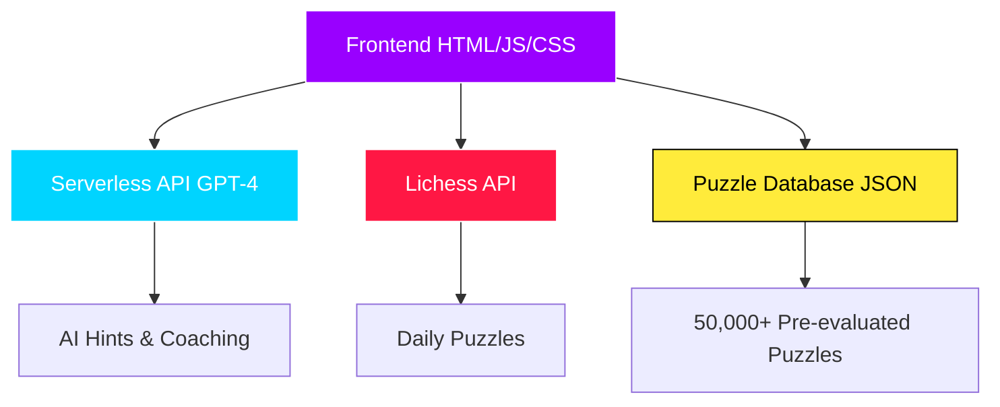

# PawnPush ♟️

PawnPush is a modern, interactive chess puzzle platform designed to help players improve their skills through a vast collection of puzzles. Featuring a sleek dark theme with vibrant purple accents, accessible online at [https://pawn-push.vercel.app](https://pawn-push.vercel.app), it offers categorized puzzles, AI-powered hints, and a coaching chat for personalized guidance.

*Experience the modern dark theme with vibrant purple accents, yellow glow hints, and immersive audio feedback*

## ✨ Features

### 🎯 **Core Puzzle Experience**
- **Multiple difficulty levels**: Beginner, Intermediate, Advanced, Grand Master
- **Various position types**: Opening, Middlegame, Endgame, Checkmate
- **Daily puzzles** with fresh content from Lichess API
- **Over 50,000 pre-evaluated puzzles** with optimal side selection
- **Interactive chessboard** with smooth drag-and-drop functionality
- **Smart puzzle orientation** - always play from the winning side

### 🤖 **AI-Powered Learning**
- **Smart hint system** powered by GPT-4 API
- **AI coaching chat** for tailored hints and explanations
- **Progressive hints** with beautiful yellow glow visual cues
- **Move validation** with instant feedback and audio cues
- **Intelligent move highlighting** - correct moves glow turquoise, wrong moves glow red

### 🎨 **Enhanced User Experience**
- **Modern dark theme** with deep `#121212` background for premium gaming feel
- **Vibrant purple accents** (`#9900ff`) throughout the interface
- **Chess.com piece theme** for professional, familiar appearance
- **Yellow glow hints** - beautiful visual cues for puzzle assistance
- **Audio feedback** - satisfying sound effects for moves, captures, and completions
- **Smooth animations** for puzzle transitions
- **Instant move feedback** for responsive gameplay
- **Mobile-responsive design** that works on all devices
- **Direct puzzle access** - no account required

### 🎮 **Game Modes**
- **Puzzle Mode** - Practice with filtered puzzles, automatic opponent moves
- **Survival Mode** - Test your skills with lives system and progressive difficulty  
- **Daily Puzzle** - Fresh challenge from Lichess every day with purple theme
- **Game Review** - Analyze your games position by position with AI insights
- **Automatic Opponent Responses** - Computer plays opponent moves seamlessly
- **Color-coded difficulty** - Cyan (Beginner) → Blue (Intermediate) → Yellow (Advanced) → Red (Expert)

## 🏗️ **System Architecture**



## 🛠️ Technologies Used

- **Frontend:** HTML5, CSS3, Vanilla JavaScript
- **Chessboard UI:** [Chessboard.js](https://chessboardjs.com/) with custom piece themes
- **Chess Logic:** [chess.js](https://github.com/jhlywa/chess.js) for move validation
- **AI Integration:** GPT-4 via serverless API for intelligent hints
- **External APIs:** Lichess API for daily puzzles
- **Piece Graphics:** Chess.com piece theme for professional appearance
- **Styling:** Custom CSS with modern dark theme and vibrant color system
- **Audio:** HTML5 Audio API for immersive sound effects
- **Color Scheme:** Deep dark backgrounds with purple, cyan, and red accents

## 📁 File Structure

```
PawnPush/
│
├── api/
│   └── getHint.js            # Serverless API for AI hints
│
│
├── index.html                 # Main landing page
├── puzzle.html                # Regular puzzle interface
├── dailyPuzzle.html           # Daily puzzle page
├── game-review.html           # Game analysis page
│
├── IndexScript.js             # Main site logic & daily puzzle loading
├── PuzzleScript.js            # Regular puzzle logic with audio integration
├── dailyPuzzle.js             # Daily puzzle functionality with audio
├── game-review.js             # Game analysis features with audio
├── survival.js                # Survival mode with lives system
│
├── style.css                  # Modern dark theme with purple accents
├── audio/                     # Sound effects directory
│   ├── move.mp3              # Move sound effect
│   ├── capture.mp3           # Capture sound effect
│   ├── castle.mp3            # Castling sound effect
│   ├── move-check.mp3        # Check sound effect
│   ├── wrong.mp3             # Wrong move sound effect
│   └── solved.mp3            # Puzzle solved sound effect
├── puzzles.json               # 50,000+ pre-evaluated puzzle database
├── package.json               # NPM dependencies
└── README.md                  # This file
```


## Setup Instructions

### Prerequisites

- Node.js version 12 or higher
- OpenAI API key (sign up at [OpenAI](https://platform.openai.com/))

### Installation

1. Clone the repository:

```bash
git clone <your-repo-url>
cd PawnPush
````

2. Install dependencies:

```bash
npm install
```

3. Configure environment variables:

Create a `.env` file in the root directory:

```env
OPENAI_API_KEY=your-openai-api-key
```

4. Run the development server:

```bash
npm run dev
```

The app will be available locally at `http://localhost:3000`.

## 🚀 Quick Start

### **Play Online**
Visit [https://pawn-push.vercel.app](https://pawn-push.vercel.app) to start solving puzzles immediately - no account required!

### **How to Play**
1. **Choose your mode**: Regular puzzles or Daily puzzle
2. **Select difficulty**: Beginner to Grand Master
3. **Pick position type**: Opening, Middlegame, Endgame, or Checkmate
4. **Make moves**: Drag and drop pieces on the interactive board
5. **Get hints**: Use the hint system or AI coaching chat
6. **Solve puzzles**: Complete puzzles to improve your chess skills

### **Features to Try**
- 🎯 **Daily Puzzle**: Fresh puzzle every day from Lichess with purple theme
- 🤖 **AI Coach**: Ask questions about positions and moves
- 💡 **Smart Hints**: Progressive hints with beautiful yellow glow effects
- 🔊 **Audio Feedback**: Satisfying sound effects for every move and action
- 🎨 **Modern UI**: Sleek dark theme with vibrant purple accents
- 📱 **Mobile Friendly**: Works perfectly on phones and tablets

## 🔧 How It Works

### **Puzzle System**
- **Database**: 50,000+ puzzles with pre-computed evaluations
- **Daily Updates**: Fresh puzzles from Lichess API
- **Smart Filtering**: Puzzles categorized by difficulty and position type
- **Move Validation**: Real-time validation using chess.js
- **Intelligent Orientation**: All puzzles evaluated to ensure users play the winning side
- **Seamless Gameplay**: Computer automatically plays opponent responses

### **AI Integration**
- **GPT-4 API**: Powers the intelligent hint system and coaching chat
- **Contextual Hints**: AI analyzes the current position and provides relevant guidance
- **Progressive Assistance**: Multiple hint levels from visual cues to full solutions

### **User Experience**
- **Modern Dark Theme**: Deep `#121212` background with premium gaming aesthetic
- **Vibrant Color System**: Purple (`#9900ff`) for main actions, cyan (`#00d4ff`) for secondary, red (`#ff1744`) for intense moments
- **Chess.com Pieces**: Professional, familiar piece graphics
- **Audio Integration**: Sound effects for moves, captures, castling, checks, and puzzle completion
- **Visual Feedback**: Color-coded move validation and beautiful glow effects
- **Smooth Animations**: Beautiful transitions between puzzles
- **Responsive Design**: Optimized for desktop, tablet, and mobile
- **No Registration**: Start playing immediately without creating an account

## 💼 **Business Impact**

PawnPush empowers chess players with AI-driven insights, improving problem-solving skills and offering an engaging learning experience. The platform demonstrates strong potential for scaling into a SaaS model for chess education with:

- **User Engagement**: Interactive puzzle solving with immediate feedback and progressive difficulty
- **AI-Powered Learning**: Personalized coaching and hints that adapt to user skill level
- **Scalable Architecture**: Serverless design ready for enterprise-level user growth
- **Premium User Experience**: Modern dark theme and audio feedback for professional gaming feel
- **Market Opportunity**: Growing chess education market with potential for subscription-based model

*Perfect foundation for consulting projects requiring full-stack development, AI integration, and user-centric design.*

## 🎓 **Skills Gained**

Through developing PawnPush, I've mastered:

- **Full-Stack Development**: Complete application architecture from frontend to API integration
- **AI/ML Integration**: GPT-4 API integration for intelligent coaching and hint systems
- **API Integration**: RESTful API design and external service integration (Lichess API)
- **UX/UI Design**: Modern dark theme design with cohesive color systems and responsive layouts
- **Cloud Hosting**: Serverless deployment and optimization for production environments
- **Audio Design**: HTML5 Audio API integration for immersive user experience
- **Responsive Development**: Mobile-first design ensuring cross-platform compatibility
- **Performance Optimization**: Efficient puzzle loading and real-time move validation

## 🚀 **Future Roadmap**

### **Phase 1: User Management**
- User accounts and profiles with progress tracking
- Achievement system and skill rating progression
- Social features and puzzle sharing capabilities

### **Phase 2: Enhanced Features**
- Multiplayer puzzle battles and tournaments
- Advanced AI coaching with personalized lesson plans
- Cloud-based puzzle generation using machine learning

### **Phase 3: Platform Expansion**
- Mobile app development (React Native/Flutter)
- Desktop application with offline puzzle solving

### **Phase 4: Enterprise Solutions**
- Educational platform for schools and chess clubs
- Analytics dashboard for instructors and administrators
- White-label solution for chess organizations

*This roadmap demonstrates forward-thinking architecture and scalability planning essential for consulting engagements.*

## 🤝 Contributing

Contributions are welcome! Here's how you can help:

1. **Fork** the repository
2. **Create** a feature branch (`git checkout -b feature/amazing-feature`)
3. **Commit** your changes (`git commit -m 'Add amazing feature'`)
4. **Push** to the branch (`git push origin feature/amazing-feature`)
5. **Open** a Pull Request

### **Ideas for Contributions**
- 🐛 Bug fixes and improvements
- 🎨 UI/UX enhancements
- 🧩 New puzzle categories
- 📱 Mobile app features
- 🌐 Translations

## 🌐 Live Website

**[https://pawn-push.vercel.app](https://pawn-push.vercel.app)**

---

*Made to help chess players worldwide*
